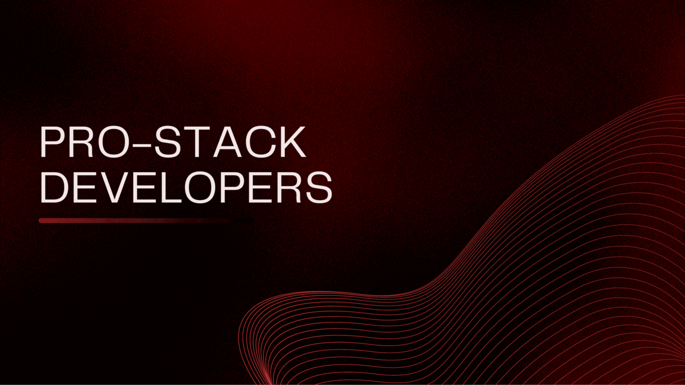

# React & Node.js app

# Development team :

- 
  Viktor Svertoka **Team Lead & Scrum Master**

- 
  Yevhenii Lukashov **Full Stack Developer**

- 
  Oleksii Khomyakov **Full Stack Developer**

- 
  Dmytro Boiko **Full Stack Developer**

- 
  Sergiy Yevchihen **Full Stack Developer**

- 
  Dimitriy Samus **Full Stack Developer**

- 
  Eduard Bruhosh **Full Stack Developer**

- 
  Serhii Kozchenko **Full Stack Developer**

- 
  Oleksii Mynenko **Full Stack Developer**

- 
  Valentyna Kirbaba **Full Stack Developer**

- 
  Olha Herasymchuk **Full Stack Developer**

# Examples of writing commits on a project

## We use the following types of commits:

- Feat(HTML) Added new functionality

- Fix(JSX) Error correction

- Perf(JPEG) Changes to improve performance

- Refactor(PNG) Code edits without fixing bugs or adding new features

- Revert(JS) Rollback to previous commits

- Style(SCSS) Code style edits

- Docs(README) Documentation update

Choose from the list the description of the commit that fits your task, in
brackets we write the file in which we worked, and in the body of the commit we
write what we did (changed) etc.

- `Look at`
  [**Layout Figma**](https://www.figma.com/file/FHAaMcWwZCDbzWPlowFhEf/Power-Pulse?type=design&node-id=0-1&mode=design)

### Commands:

- `npm install` &mdash; start
- `npm start` &mdash; server start in production mode
- `npm run start:dev` &mdash; start the server in development mode
- `npm run lint` &mdash; run a code check execution with eslint is necessary run
  before each PR and fix all linter errors
- `npm lint:fix` &mdash; same linter check but with automatic ones corrections
  of simple errors

https://power-pulse-back-end.onrender.com/api-docs/
